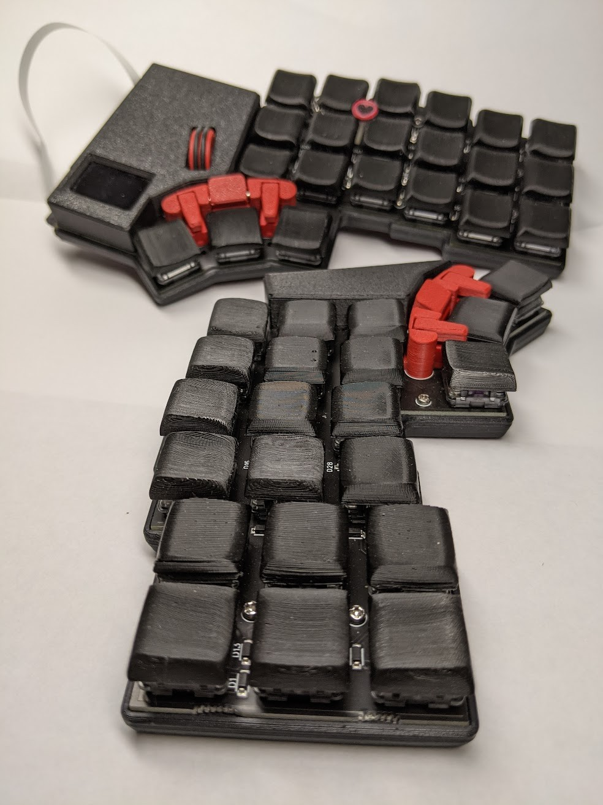
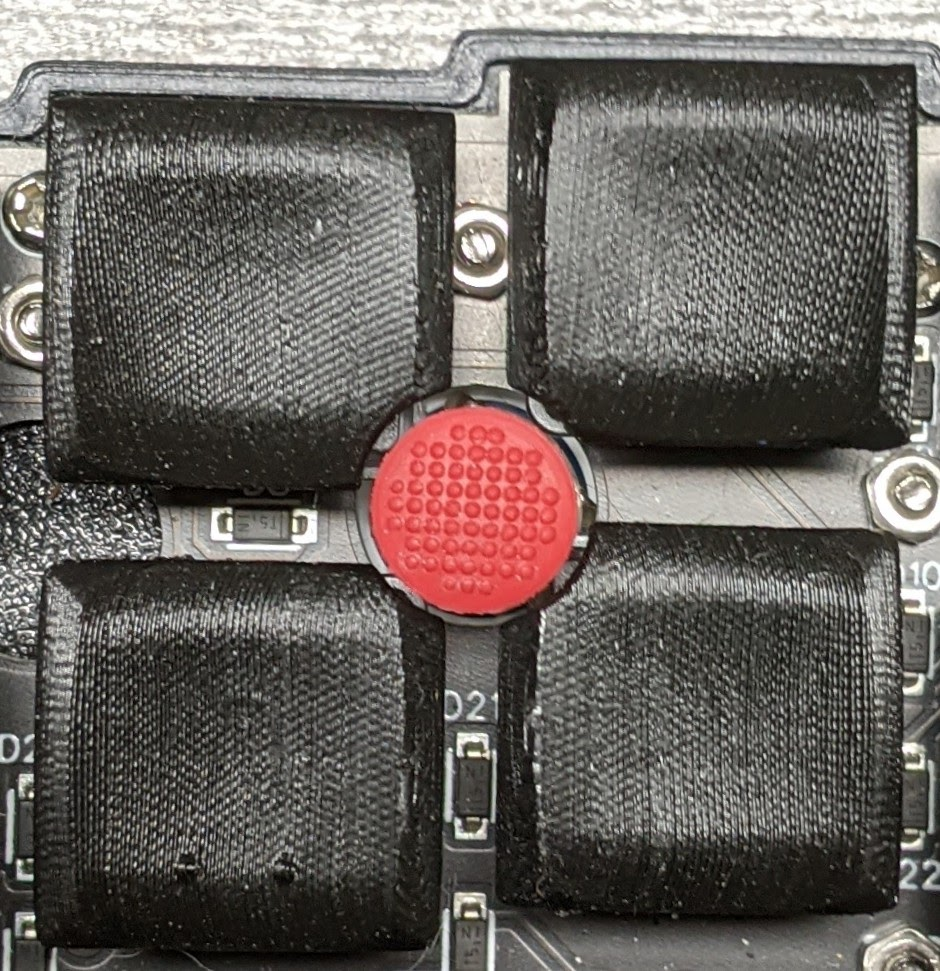
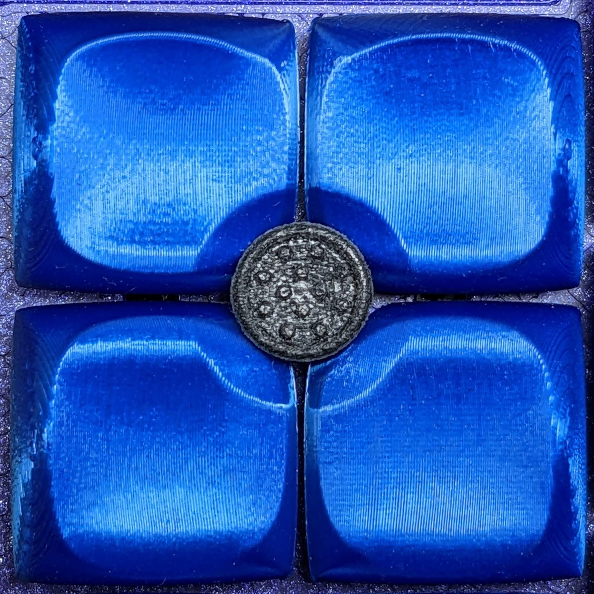
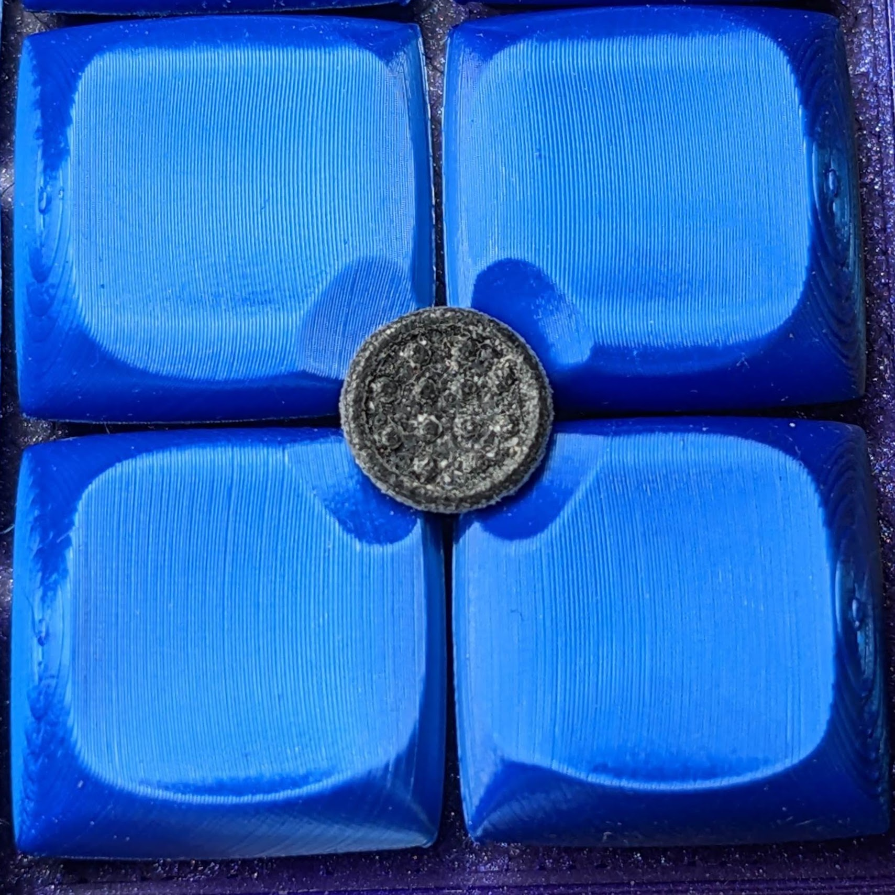

# Print Keycaps That Feel Great

This code modifies and positions open source keycaps, such as Chicago Steno and DES, for FDM printing. It can also be used in cases where only model files, such as STLs are provided, as is the case with LPX.

My twin goals are smooth, comfortable typing surfaces and the ability to use the keycaps right off the print bed; minimal post-processing is required, mainly popping off the supports.

<!-- markdown-toc start - Don't edit this section. Run M-x markdown-toc-refresh-toc -->
**Table of Contents**

  - [Mods for Printing](#mods-for-printing)
  - [Modify Keycaps to Fit Around Trackpoint](#modify-keycaps-to-fit-around-trackpoint)
    - [Notch Styles](#notch-styles)
      - [No chamfer](#no-chamfer)
      - [Uniform Depth Chamfer](#uniform-depth-chamfer)
      - [Stair-Stepped Chamfer](#stair-stepped-chamfer)
    - [Placement](#placement)
  - [Stupid Stem Tricks](#stupid-stem-tricks)
    - [Stem Swap](#stem-swap)
    - [Stem Offsets](#stem-offsets)
      - [Stem Offsets for S-Curved Dactyl Columns](#stem-offsets-for-s-curved-dactyl-columns)
      - [Stem Offsets for Changing Key Spacing](#stem-offsets-for-changing-key-spacing)
      - [Stem Offsets for Changing Column Stagger](#stem-offsets-for-changing-column-stagger)
  - [Profiles](#profiles)
    - [LPX](#lpx)
    - [LPxMX](#lpxmx)
    - [Chicago Steno](#chicago-steno)
    - [DES-LP](#des-lp)
    - [DES-uLP](#des-ulp)
- [Usage](#usage)
- [FDM Printing Suggestions](#fdm-printing-suggestions)
- [SLA Printing Suggestions](#sla-printing-suggestions)
- [Suggestions Welcome!](#suggestions-welcome)
- [In Progress](#in-progress)
- [TODO](#todo)

<!-- markdown-toc end -->

## Mods for Printing
First, keycaps are rotated on the Y-axis to minimize the feel of layer lines as your finger moves across the face.

Second, the top of the cap is turned to face the part cooling fan for best surface quality.

Third, the place where the keycap contacts the bed is trimmed to create a flat patch parallel to the bed that will adhere. The stem is also trimmed in several places to adhere to the support material and avoid issues with insertion onto the key switch.

Fourth, the sculpt of the key cap is compensated for when trimming, so that the layer lines run parallel to the keycap sides. Without this, the lines run on a diagonal across sculpted keys and  can be more noticable to your fingers. However, it can create gaps in the keycap skirt of highly sculpted keycaps like DES, so it may be disabled in `settings.scad`.

Finally, for DES-uLP, marks are added to identify the row and orientation of a keycap.

## Modify Keycaps to Fit Around Trackpoint

No Chamfer | Stair-Stepped Chamfer | Uniform Depth Chamfer
:---: | :---: | :---:
 |  | 

<!--
 |  | 
-->

<!--

 

-->

This code can also cut notches in keycap models to make room for a trackpoint's rubber dome. No need to drill or grind them down. This can be done to match flat, staggered, or curved keyboards with standard MX or choc spacing or bespoke spacing. A number of preset spacings exist and it can be easily modified to accommodate any keyboard layout.

### Notch Styles

#### No chamfer
The style of trackpoint notch is controlled in `settings.scad`. Setting `tp_chamfer() = false` will make a simple 9.7 mm hole that surrounds the trackpoint cap, as seen in the image above on the left (the gaps between keycaps are because this is an MX spaced board with choc keycaps). 

Chamfered styles fit under the rim of the trackpoint cap, which both visually conceals the hole and prevents your finger from detecting an uncomfortable edge. I have implemented two approaches with some trade-offs.

#### Uniform Depth Chamfer
The image above on the right is with `tp_uniform_depth() = true` which finds the highest point on the keycap and removes material from that point in a cone. The resulting shape is not circular, but it is compact and intrudes less into the interior of the keycap, has a uniform depth that is less likely to create a thin spot in the keycap, and is fast to compute when prerendering is used. It also produces a smooth surface with compact geometry. Its computational overhead can be reduced by increasing `tp_rotational_steps()` (it defines step size, default 1 degree) with the accompanying risk that the highest point will not be detected and the chamfer will cut deeper into the keycap creating a lip.

#### Stair-Stepped Chamfer
The image in the middle is with `tp_uniform_depth() = false`. It lowers each point on the surface of the keycap by a fixed amount, which creates a circular notch that matches the style of Thinkpad keycaps. However, for keycaps that aren't flat, this means removing the same amount of material from high spots and low spots, which lowers the low spots by more than necessary. This can create very thin edges at the lip of the notch which are harder to print cleanly. Fortunately, they are covered by the rim of the trackpoint cap.  Finally, it can be very computationally and memory intensive, although prerendering makes dramatic improvements here as well, I recommend setting `function tp_chamfer() = $preview ? false : true;` to disable computing this chamfer during previews, which don't benefit from the parallel [manifold](https://github.com/elalish/manifold) backend. The resulting surface is stepped at a size controlled by `tp_chamfer_steps()` (again step size, default .05 mm). The steps are small enough to not be visible in the resulting print but to achieve this they add a lot of geometry to the model which increases file size and slicer load times.

### Placement
Trackpoint keys are any regular key suffixed with a pair of cardinal directions, i.e. `-NW`, `-NE`, `-SW`, `-SE`. You can pick a different trackpoint placement by editing `TPKEYS` and, if your profile has chording/lateral keys that you use, `TPLATS` in the _Makefile_.

## Stupid Stem Tricks
For non-SCAD keycaps we can easily remove the stem using a `difference()` and replace it with whatever we like. This opens several possibilities. For SCAD keycaps we can likely tweak the source directly, or pass appropriate parameters.

### Stem Swap
The LPxMX profile is a choc keycap on an MX stem from @rsheldiii's [keyV2 library](https://github.com/rsheldiii/KeyV2.git) which was designed to be amenable to FDM printing, but not for enclosed stem sockets, such as box switches or most low profile MX-compatable switches. There are other stem variants that could be used in those cases.

### Stem Offsets
LPX offsets are currently implemented in Y only and integrated into the Makefile as the `lpx-offset` target. Edit the `OFFSET` variable in the makefile to control what gets generated.

Work in progress code for CS stem offsets in both X and Y is [in my stem offset branch](https://github.com/wolfwood/PseudoMakeMeKeyCapProfiles/tree/stem-offset). On this branch, the stem offset of a keycap is controlled by passing `$stem_offset=[x,y]` where x and y are the desired offset in each direction (or 0).

#### Stem Offsets for S-Curved Dactyl Columns
For dactyls using a typical cylindrical column placement, there is no issue with the keyswitches colliding. However, if we try to have a convex portion of our column (such as for the number row) the tightly packed keycaps may cause the switches below to collide. Using an offset stem allows us to pack keycaps more tightly, while spacing the switches far enough apart that they don't intersect.

#### Stem Offsets for Changing Key Spacing
For example, on an MX spaced (19.05 mm between key centers in both X and Y) board with choc switches using CS, you might prefer to have choc spacing (17 mm in Y, 18 mm in X). Using stem offsets, you can bring R2 and R4 2 mm closer to the homerow with stem offset. For Pinkie and Index columns, you can do the same, and also move the outside columns 1 mm closer to the center of the board. you could even move your middle and ring finger columns together by .5 mm a piece.

#### Stem Offsets for Changing Column Stagger
You can also use stem offsets to change the amount of column stagger. For example, I was able to lower the pinkie columns on an MX spaced board by 6 mm using a Y offset.

## Profiles
### LPX
A Choc keycap that can support tighter spacing, as little as 16.5mm in X, 15.5 mm in Y.

No unmodified keycap is generated. Use [the source *.stl* file](https://github.com/levpopov/LPX/blob/main/LPX.stl).

Since LPX is a symmetrical, non-sculpted profile, right now only two trackpoint-modded keycaps are generated, "near" and "far". Support for a homing key could be added.

[LPX](https://github.com/levpopov/LPX) designed by @levpopov.

### LPxMX
A modified version of LPX for MX stems.

<!-- [LPX](https://github.com/levpopov/LPX) designed by @levpopov. -->

### Chicago Steno
A full set of choc keycaps including chording laterals and thumbs, suitable for standard 18 mm X, 17 mm Y choc spacing, can be rendered for printing.

For trackpoint use, the default placement is between four R2 and R3 keys. Both regular and lateral keys are generated.

[Chicago Steno](https://github.com/pseudoku/PseudoMakeMeKeyCapProfiles) from @pseudoku is made available under the GPL v3.

### DES-LP
DES was originally designed for MX switches. This version swaps to Choc stems and lowers the key height to the minimum necessary. The original, standard MX spacing of 19 mm in X and Y is unchanged, although I have found that they can be used with 18.5 mm in X and Y without issue.

[DES](https://github.com/pseudoku/PseudoMakeMeKeyCapProfiles) from @pseudoku is made available under the GPL v3, my modification lives [here](https://github.com/wolfwood/PseudoMakeMeKeyCapProfiles).

### DES-uLP
This Choc version of DES removes the keycap sculpting, further lowering the key height an making it roughly uniform across rows. The intended use is for Dactyl keyboards, where the curvature of the column provides the sculpting instead.

This version focuses on R2-R4 but also incorporates DES chording lateral variants.

<!-- [DES](https://github.com/pseudoku/PseudoMakeMeKeyCapProfiles) from @pseudoku is made available under the GPL v3, my DES-uLP modification lives [here](https://github.com/wolfwood/PseudoMakeMeKeyCapProfiles). -->

# Usage
This repository relies on submodules to include keycaps where possible. Either clone it with the command `git clone --recurse-submodules --remote-submodules` to automatically fetch submodules, or run `git submodule update --init --recursive` in an already cloned repo before using.

Keycaps can be rendered using `make`. First edit `settings.scad` to set the keyboard spacing for trackpoint keys, if using. Also adjust `fan_rotation` to match your printer. 0° is for a fan on the left of the nozzle, 90° for a fan in front of the nozle like the Prusa MK4S.

If you run `make` without arguments, it will render all profiles and positions for a given board. To save render time you can invoke a specific keycap profile target such as `make lpx` or a stem style target such as `make choc`. A set of unmodified Chicago Steno keycaps can be generated with `make cs`. The targets with a _-tp_ suffix such as `cs-tp` generate trackpoint-modified keycaps, and `make tp` will build trackpoint keys for all profiles. All target names are lower case.

`make -j 16 -l 16 des-lp des-lp-tp` will render keycaps in parallel, running at most 16 jobs at a time and capping the CPU load at 16.

I strongly recommend downloading [a development snapshot of OpenSCAD](https://openscad.org/downloads.html#snapshots) and replacing the `OPENSCAD=openscad` line at the begining of the Makefile with the path to the downloaded build (don't forget to `chmod +x` it first, if using an AppImage). The makefile will automatically detect and use the `manifold` backend when available which is orders of magnitude faster than the older CGAL backend for this codebase.

# FDM Printing Suggestions
Parts are positioned with a 45 degree Y and Z rotation. These recommendations come from @levpopov. The Y rotation produces a smoother surface than printing flat. The Z rotation slows the print head and gets maximum cooling on the top surface.

If using a keycap array *.stl*, split the model to objects in your slicer, then enable *complete individual objects*.

The main issue I've had has been with the bottom edge of the keycap partially or full detaching during the print. The support tweaks are meant to address this issue, along with the model modifications to flatten the edges the keycap rests on while printing.

  - *layer height* - On the Prusa MK3S I used 0.1 mm. 0.07 mm is doable but arguably feels worse. 0.15 is acceptable and definitely where you should start your testing before trying to print multiple keycaps. On the Prusa MK4 I was able to use .05 mm with a brim which produced a very smooth top surface, but also a rough patch on one edge.
  - *0% infill* - This helps with surface smoothness. also faster.
  - *enable supports* - This thing is gonna tip over if you don't support it! I have preferred to use traditional supports. Tree supports are definitely not effective without a brim; the whole model benefits from a solid support structure. As of prusaslice 2.6, the default is support style is snug, which applies the following by default.
	- *Top contact Z distance* = 0.10 - get supports closer to the part
    - *Pattern spacing* = 1.5 - more supportive
  - *Complete individual objects* - prints parts one at a time so there isn't stringing between keycaps ruining the top surface. you also need to split models with multiple keycaps, if using.

# SLA Printing Suggestions
??? Someone with a resin printer please tell us.

# Suggestions Welcome!
Please open an issue to request support for new keycaps, new keyboards, flexibility in selecting row variants, etc. I'd like to expand this tool to accommodate as many uses as possible.

# In Progress
- [ ] add row/orientation marks to more profiles
- [ ] selectable stem type
- [ ] generic support for stem offsets

# TODO
  - [ ] alternate MX stems for box and LP switches
  - [ ] PG1316S "stem"
  - [ ] try out more keycaps from https://github.com/namnlos-io/choc_keycaps
  - [ ] https://github.com/madebyperce/shelby-min-mx-keycaps LPxMX alternative?
  - [ ] support keycaps from keyV2? rewrite this code within the framework of keyV2?
  - [ ] standardize homing dot/dots/bar/deepdish config?
  - [ ] makefile rules to fetch submodules if missing
